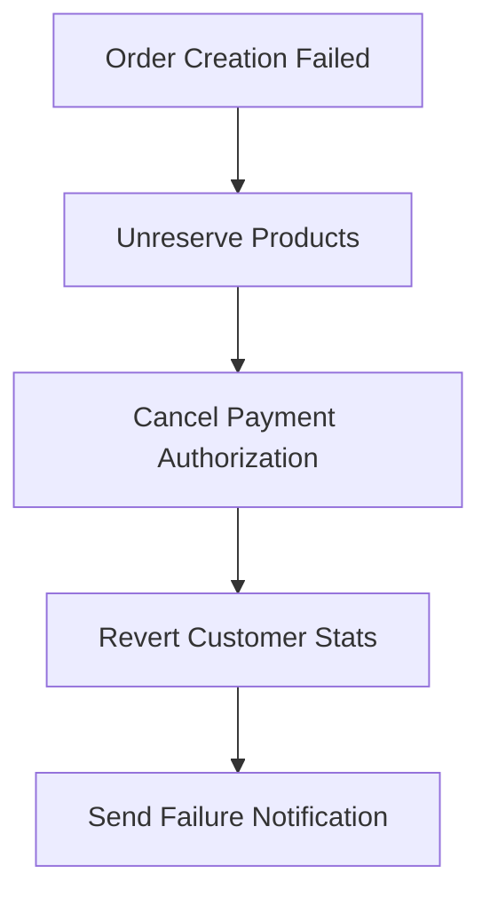

# Data Consistency Strategies for Microservices Architecture

## Overview

This document outlines the data consistency strategies for maintaining data integrity across the microservices in the SimpleCRM system. We employ a combination of patterns including Saga, Event Sourcing, CQRS, and eventual consistency.

## 1. Consistency Patterns by Service

### 1.1 Strong Consistency (Within Service Boundaries)
- **Customer Service**: Customer and Address data (same database, ACID transactions)
- **Order Service**: Order and OrderLine data (same database, ACID transactions)  
- **Auth Service**: User and Session data (same database, ACID transactions)
- **Catalog Service**: Product and Category data (same database, ACID transactions)

### 1.2 Eventual Consistency (Cross-Service)
- Customer updates → Order service (for order history)
- Product updates → Order service (for pricing updates)
- User updates → All services (for audit trails)
- Order events → Customer service (for customer analytics)

## 2. Saga Pattern Implementation

### 2.1 Order Processing Saga

**Business Transaction**: Create a new order with payment processing

**Saga Steps**:
1. **Validate Customer** (Customer Service)
2. **Check Product Availability** (Catalog Service)
3. **Reserve Products** (Catalog Service)
4. **Calculate Pricing** (Order Service)
5. **Process Payment** (Payment Service)
6. **Create Order** (Order Service)
7. **Update Customer Stats** (Customer Service)
8. **Send Confirmation** (Notification Service)

**Compensation Actions**:


#### Implementation Example:

```java
@Component
public class OrderProcessingSaga {
    
    @SagaStart
    public void handle(CreateOrderCommand command) {
        // Step 1: Validate Customer
        send(new ValidateCustomerCommand(command.getCustomerId()));
    }
    
    @SagaHandler
    public void handle(CustomerValidatedEvent event) {
        // Step 2: Check Product Availability  
        send(new CheckProductAvailabilityCommand(event.getOrderData()));
    }
    
    @SagaHandler
    public void handle(ProductsAvailableEvent event) {
        // Step 3: Reserve Products
        send(new ReserveProductsCommand(event.getProducts()));
    }
    
    // ... continue with other steps
    
    // Compensation handlers
    @SagaHandler
    public void handle(PaymentFailedEvent event) {
        send(new UnreserveProductsCommand(event.getOrderId()));
    }
}
```

### 2.2 Customer Update Saga

**Business Transaction**: Update customer information across all services

**Saga Steps**:
1. **Update Customer** (Customer Service)
2. **Update Order History** (Order Service)
3. **Update Contact References** (Contact Service)
4. **Sync Analytics** (Analytics Service)

## 3. Event Sourcing for Audit and Recovery

### 3.1 Event Store Schema

```sql
CREATE TABLE event_store (
    id BIGSERIAL PRIMARY KEY,
    aggregate_id VARCHAR(255) NOT NULL,
    aggregate_type VARCHAR(100) NOT NULL,
    event_type VARCHAR(100) NOT NULL,
    event_version INTEGER NOT NULL,
    event_data JSONB NOT NULL,
    metadata JSONB,
    created_at TIMESTAMP DEFAULT NOW(),
    
    UNIQUE(aggregate_id, event_version)
);

CREATE INDEX idx_event_store_aggregate ON event_store(aggregate_id, aggregate_type);
CREATE INDEX idx_event_store_type ON event_store(event_type);
CREATE INDEX idx_event_store_created ON event_store(created_at);
```

### 3.2 Critical Events to Store

**Customer Events**:
- CustomerCreated
- CustomerUpdated  
- CustomerDeactivated
- CustomerAddressChanged

**Order Events**:
- OrderPlaced
- OrderConfirmed
- OrderShipped
- OrderDelivered
- OrderCancelled
- PaymentProcessed
- PaymentFailed

**Product Events**:
- ProductCreated
- ProductUpdated
- ProductPriceChanged
- ProductStockChanged
- ProductDiscontinued

### 3.3 Event Replay for Recovery

```java
@Service
public class EventReplayService {
    
    public void replayEventsForAggregate(String aggregateId, LocalDateTime fromTime) {
        List<Event> events = eventStore.findEventsAfter(aggregateId, fromTime);
        
        for (Event event : events) {
            switch (event.getEventType()) {
                case "CustomerUpdated":
                    republishCustomerUpdatedEvent(event);
                    break;
                case "OrderPlaced":
                    republishOrderPlacedEvent(event);
                    break;
                // ... handle other event types
            }
        }
    }
}
```

## 4. CQRS (Command Query Responsibility Segregation)

### 4.1 Read Models for Cross-Service Queries

**Customer Order Summary Read Model**:
```sql
-- In Customer Service Database
CREATE TABLE customer_order_summary (
    customer_id BIGINT PRIMARY KEY,
    total_orders INTEGER DEFAULT 0,
    total_spent DECIMAL(10,2) DEFAULT 0.00,
    last_order_date TIMESTAMP,
    average_order_value DECIMAL(10,2) DEFAULT 0.00,
    favorite_products JSONB,
    updated_at TIMESTAMP DEFAULT NOW()
);
```

**Product Sales Analytics Read Model**:
```sql
-- In Catalog Service Database  
CREATE TABLE product_sales_analytics (
    product_id BIGINT PRIMARY KEY,
    total_sold INTEGER DEFAULT 0,
    total_revenue DECIMAL(10,2) DEFAULT 0.00,
    last_sale_date TIMESTAMP,
    avg_sale_price DECIMAL(10,2),
    top_customers JSONB,
    updated_at TIMESTAMP DEFAULT NOW()
);
```

### 4.2 Event Handlers to Update Read Models

```java
@EventHandler
public class CustomerOrderSummaryProjection {
    
    @EventHandler
    public void on(OrderPlacedEvent event) {
        CustomerOrderSummary summary = getOrCreate(event.getCustomerId());
        summary.incrementTotalOrders();
        summary.addToTotalSpent(event.getTotalAmount());
        summary.updateLastOrderDate(event.getCreatedAt());
        summary.recalculateAverageOrderValue();
        repository.save(summary);
    }
    
    @EventHandler  
    public void on(OrderCancelledEvent event) {
        CustomerOrderSummary summary = get(event.getCustomerId());
        if (summary != null) {
            summary.decrementTotalOrders();
            summary.subtractFromTotalSpent(event.getTotalAmount());
            summary.recalculateAverageOrderValue();
            repository.save(summary);
        }
    }
}
```

## 5. Data Synchronization Mechanisms

### 5.1 Event-Driven Synchronization

**Message Broker Configuration** (RabbitMQ):
```yaml
# Exchanges and Queues
exchanges:
  - name: customer.events
    type: topic
    durable: true
  - name: order.events  
    type: topic
    durable: true
  - name: product.events
    type: topic
    durable: true

queues:
  - name: order-service.customer-events
    exchange: customer.events
    routing-key: customer.*
  - name: customer-service.order-events
    exchange: order.events
    routing-key: order.placed
  - name: catalog-service.order-events
    exchange: order.events
    routing-key: order.*
```

### 5.2 Periodic Synchronization Jobs

**Data Reconciliation Service**:
```java
@Service
public class DataReconciliationService {
    
    @Scheduled(cron = "0 0 2 * * ?") // Run at 2 AM daily
    public void reconcileCustomerOrderData() {
        List<Customer> customers = customerService.getAllCustomers();
        
        for (Customer customer : customers) {
            OrderSummary actualSummary = orderService.getOrderSummary(customer.getId());
            CustomerOrderSummary cachedSummary = readModelRepository.findByCustomerId(customer.getId());
            
            if (!actualSummary.equals(cachedSummary)) {
                // Log discrepancy and trigger reconciliation
                reconcileCustomerSummary(customer.getId(), actualSummary);
            }
        }
    }
}
```

### 5.3 Change Data Capture (CDC)

**Database Triggers for Critical Changes**:
```sql
-- Customer Service - Trigger for customer changes
CREATE OR REPLACE FUNCTION notify_customer_change()
RETURNS TRIGGER AS $$
BEGIN
    -- Insert into outbox for reliable event publishing
    INSERT INTO outbox_events (aggregate_id, aggregate_type, event_type, event_data)
    VALUES (
        NEW.id::TEXT,
        'Customer',
        TG_OP || '_Customer',
        jsonb_build_object(
            'customerId', NEW.id,
            'name', NEW.name,
            'email', NEW.email,
            'status', NEW.status
        )
    );
    RETURN NEW;
END;
$$ LANGUAGE plpgsql;

CREATE TRIGGER trigger_customer_change
    AFTER INSERT OR UPDATE OR DELETE ON customers
    FOR EACH ROW EXECUTE FUNCTION notify_customer_change();
```

## 6. Conflict Resolution Strategies

### 6.1 Last-Writer-Wins with Timestamps

```java
@Entity
public class Customer {
    private Long version;
    private LocalDateTime lastModified;
    private String lastModifiedBy;
    
    // Optimistic locking
    @Version
    private Long version;
}

@Service
public class CustomerConflictResolver {
    
    public Customer resolveConflict(Customer local, Customer remote) {
        if (remote.getLastModified().isAfter(local.getLastModified())) {
            return remote; // Remote wins
        }
        return local; // Local wins
    }
}
```

### 6.2 Business Rules-Based Resolution

```java
public class OrderConflictResolver {
    
    public Order resolveOrderConflict(Order local, Order remote) {
        // Business rule: Cannot modify orders that are already shipped
        if (local.getStatus() == OrderStatus.SHIPPED) {
            throw new ConflictException("Cannot modify shipped order");
        }
        
        // Business rule: Price changes require approval
        if (!local.getTotalAmount().equals(remote.getTotalAmount())) {
            return flagForManualReview(local, remote);
        }
        
        return mergeOrderChanges(local, remote);
    }
}
```

## 7. Monitoring and Alerting

### 7.1 Consistency Monitoring

```sql
-- View to detect data inconsistencies
CREATE VIEW data_consistency_report AS
SELECT 
    'Customer-Order Mismatch' as issue_type,
    c.id as entity_id,
    c.name as entity_name,
    'Order count mismatch' as description,
    cos.total_orders as cached_count,
    actual_orders.order_count as actual_count
FROM customers c
JOIN customer_order_summary cos ON c.id = cos.customer_id
JOIN (
    SELECT customer_id, COUNT(*) as order_count 
    FROM orders 
    GROUP BY customer_id
) actual_orders ON c.id = actual_orders.customer_id
WHERE cos.total_orders != actual_orders.order_count;
```

### 7.2 Saga Monitoring

```java
@Component
public class SagaMonitor {
    
    @EventListener
    public void handleSagaTimeout(SagaTimeoutEvent event) {
        logger.error("Saga timeout detected: {}", event.getSagaId());
        alertingService.sendAlert(
            "Saga Timeout", 
            "Saga " + event.getSagaId() + " has timed out",
            AlertSeverity.HIGH
        );
        
        // Trigger compensation actions
        sagaManager.compensate(event.getSagaId());
    }
}
```

## 8. Performance Considerations

### 8.1 Event Batching

```java
@Service
public class EventBatchProcessor {
    
    @Scheduled(fixedDelay = 5000) // Process every 5 seconds
    public void processBatchedEvents() {
        List<OutboxEvent> events = outboxRepository.findUnprocessedEvents();
        
        if (!events.isEmpty()) {
            List<CompletableFuture<Void>> futures = events.stream()
                .collect(Collectors.groupingBy(OutboxEvent::getEventType))
                .entrySet().stream()
                .map(entry -> publishEventsBatch(entry.getKey(), entry.getValue()))
                .collect(Collectors.toList());
                
            CompletableFuture.allOf(futures.toArray(new CompletableFuture[0]))
                .thenRun(() -> markEventsAsProcessed(events));
        }
    }
}
```

### 8.2 Read Model Optimization

```sql
-- Materialized views for better performance
CREATE MATERIALIZED VIEW customer_analytics_mv AS
SELECT 
    c.id,
    c.name,
    c.email,
    c.status,
    cos.total_orders,
    cos.total_spent,
    cos.last_order_date,
    cos.average_order_value
FROM customers c
LEFT JOIN customer_order_summary cos ON c.id = cos.customer_id;

-- Refresh schedule
CREATE OR REPLACE FUNCTION refresh_customer_analytics()
RETURNS void AS $$
BEGIN
    REFRESH MATERIALIZED VIEW CONCURRENTLY customer_analytics_mv;
END;
$$ LANGUAGE plpgsql;

-- Schedule refresh every hour
SELECT cron.schedule('refresh-customer-analytics', '0 * * * *', 'SELECT refresh_customer_analytics();');
```

## 9. Testing Data Consistency

### 9.1 Integration Tests for Sagas

```java
@SpringBootTest
@TestPropertySource(properties = "spring.cloud.stream.test-binder=true")
public class OrderSagaIntegrationTest {
    
    @Test
    public void testSuccessfulOrderProcessing() {
        // Given
        CreateOrderCommand command = new CreateOrderCommand(customerId, products);
        
        // When
        sagaManager.handle(command);
        
        // Then
        await().atMost(10, SECONDS).until(() -> {
            Order order = orderRepository.findByOrderNumber(command.getOrderNumber());
            return order != null && order.getStatus() == OrderStatus.CONFIRMED;
        });
        
        // Verify all side effects
        assertThat(customerOrderSummary.getTotalOrders()).isEqualTo(1);
        assertThat(productInventory.getReservedQuantity()).isEqualTo(0);
    }
    
    @Test  
    public void testOrderProcessingWithPaymentFailure() {
        // Given
        CreateOrderCommand command = new CreateOrderCommand(customerId, products);
        mockPaymentService.simulateFailure();
        
        // When
        sagaManager.handle(command);
        
        // Then - verify compensation occurred
        await().atMost(10, SECONDS).until(() -> {
            return productInventory.getReservedQuantity() == 0; // Products unreserved
        });
        
        assertThat(orderRepository.findByOrderNumber(command.getOrderNumber())).isNull();
    }
}
```

### 9.2 Chaos Engineering for Consistency

```java
@Component
public class ConsistencyChaosTest {
    
    @EventListener
    @ConditionalOnProperty("chaos.consistency.enabled")
    public void introduceNetworkPartition(OrderPlacedEvent event) {
        if (shouldIntroduceChaos()) {
            // Simulate network partition between services
            networkChaos.partitionServices("order-service", "customer-service", Duration.ofSeconds(30));
            
            // Monitor how system handles the partition
            consistencyMonitor.trackPartitionImpact(event.getOrderId());
        }
    }
}
```

This comprehensive data consistency strategy ensures that the microservices maintain data integrity while providing the flexibility and scalability benefits of a distributed architecture.